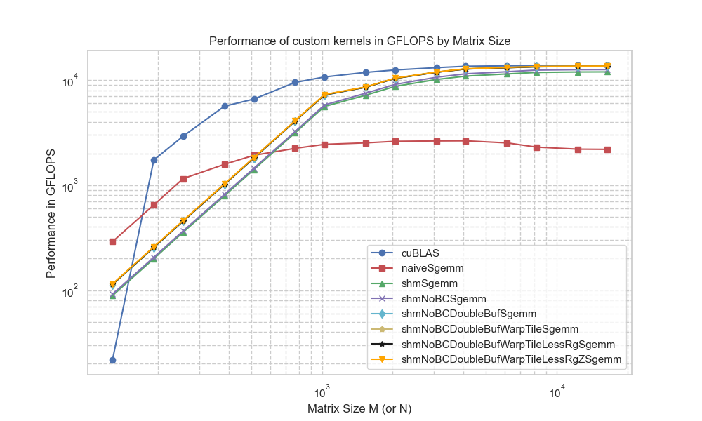
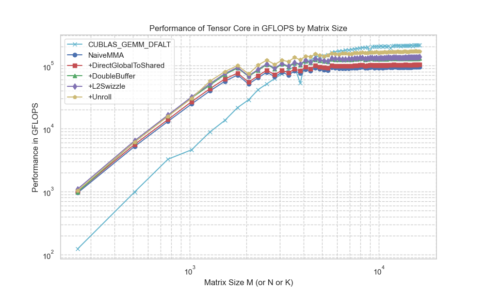

# ParaBox
Practice of Efficient CUDA Programming

---
# Gemm in SIMT

|   | V1 |  V2 | V3  |  V4 |  V5 | V6  |  V7 |
|---|---|---|---|---|---|---|---|
| shared Memory  |   | ✓  |  ✓ |  ✓ |  ✓ |  ✓ | ✓  |
| No Bank-conflict  |   |   |  ✓ |✓   | ✓  |✓   | ✓  |
| Double Buffer  |   |   |   | ✓  | ✓  | ✓  |  ✓ |
| Warp Tile  |   |   |   |   |  ✓ | ✓  |  ✓ |
|  Less Registers |   |   |   |   |  | ✓  |  ✓ |
| L2 Swizzle  |   |   |   |   |   |   | ✓  |

---
# Gemm in Tensor Core

|   | V1 |  V2 | V3  |  V4 |  V5 | 
|---|---|---|---|---|---|
| Direct gmem-smem  |   | ✓  |  ✓ |  ✓ |  ✓ | 
| Double Buffer  |   |   |  ✓ |✓   | ✓  |
| L2 Swizzle  |   |   |   | ✓  | ✓  | 
| Unroll  |   |   |   |   |  ✓ |

